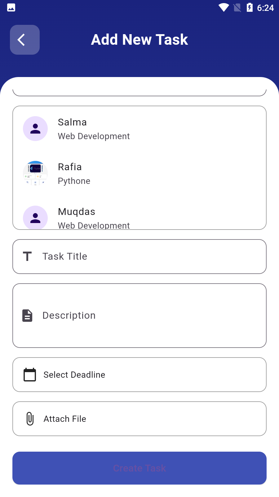

# 7-Skies-Solution

<div align="center">
  <h1>
    <br/>
    7-Skies-Solution
  </h1>
  <h3>A Comprehensive Educational Management System with Multi-Role Support</h3>
</div>

<p align="center">
    <a href="https://github.com/" target="_blank">
        
    </a>
    <a href="https://www.linkedin.com/" target="_blank">
        
    </a>
    <a href="APK/app.apk" target="_blank">
        
    </a>
    <a href="https://skiessolutions-6d6bb.web.app/" target="_blank">
        
    </a>
</p>

## 📌 Overview

7-Skies-Solution is a comprehensive educational management system built with Flutter that provides a complete solution for educational institutions. The application supports multiple user roles including Students, Teachers, Administrators, and Owners, each with their specific functionalities and access levels.

## 🌐 Live Demo

**Web Admin Panel**: [https://skiessolutions-6d6bb.web.app/](https://skiessolutions-6d6bb.web.app/)

Experience the full web admin interface with all features and functionalities.

## 🚀 Tech Stack

- **Flutter** (Cross-platform UI Framework)
- **GetX** (State Management & Navigation)
- **Firebase** (Backend Services)
  - Cloud Firestore (Database)
  - Firebase Storage (File Storage)
  - Firebase Messaging (Push Notifications)
- **SQLite** (Local Database)
- **PDF Generation & Viewing**
- **Image Processing & Caching**

## 🔑 Key Features

### 👨‍🎓 Student Features
- ✅ **Dashboard**: Personalized student dashboard with course overview
- ✅ **Course Management**: View enrolled courses and course details
- ✅ **Task Management**: View and complete assigned tasks
- ✅ **Fee Management**: View fee vouchers and payment history
- ✅ **Timetable**: Access class schedules and timetables
- ✅ **Feedback System**: Submit feedback and suggestions
- ✅ **Profile Management**: Update personal information and profile picture
- ✅ **Chat with Admin**: Direct communication with administrators

### 👨‍🏫 Teacher Features
- ✅ **Student Management**: Add, view, and manage students
- ✅ **Course Management**: Create and manage courses
- ✅ **Task Assignment**: Create and assign tasks to students
- ✅ **Timetable Management**: Create and edit class schedules
- ✅ **Certificate Generation**: Generate student certificates
- ✅ **Profile Management**: Update teacher profile and settings

### 👨‍💼 Admin Features
- ✅ **User Management**: Manage students and teachers
- ✅ **Course Administration**: Oversee course creation and management
- ✅ **Task Oversight**: Monitor task assignments and completions
- ✅ **Fee Management**: Handle fee structures and payments
- ✅ **Analytics Dashboard**: View comprehensive statistics and reports
- ✅ **System Settings**: Configure application settings

### 👑 Owner Features
- ✅ **Admin Management**: Add and manage administrators
- ✅ **Expense Management**: Track institutional expenses
- ✅ **Financial Reports**: Comprehensive financial analytics
- ✅ **System Overview**: Complete system monitoring and control

## 📸 Banners

<div align="center">
  
  
  
  
  
  
</div>

## 📸 Screenshots

### 🎯 Splash & Authentication

<table border="1">
  <tr>
    <td align="center">
      
      <p><b>Splash Screen</b></p>
    </td>
    <td align="center">
      
      <p><b>Login Screen</b></p>
    </td>
    <td align="center">
      
      <p><b>Loading Screen</b></p>
    </td>
  </tr>
</table>

### 👨‍🎓 Student Interface

<details>
<summary><b>📱 Student Screenshots (Click to expand)</b></summary>

<table border="1">
  <tr>
    <td align="center">
      
      <p><b>Student Dashboard</b></p>
    </td>
    <td align="center">
      
      <p><b>Student Profile</b></p>
    </td>
    <td align="center">
      
      <p><b>Profile Update</b></p>
    </td>
  </tr>
  <tr>
    <td align="center">
      
      <p><b>My Tasks</b></p>
    </td>
    <td align="center">
      
      <p><b>Completed Tasks</b></p>
    </td>
    <td align="center">
      
      <p><b>Pending Tasks</b></p>
    </td>
  </tr>
  <tr>
    <td align="center">
      
      <p><b>Empty Tasks</b></p>
    </td>
    <td align="center">
      
      <p><b>Timetable</b></p>
    </td>
    <td align="center">
      
      <p><b>Timetable View</b></p>
    </td>
  </tr>
  <tr>
    <td align="center">
      
      <p><b>Fee Vouchers</b></p>
    </td>
    <td align="center">
      
      <p><b>Feedback</b></p>
    </td>
    <td align="center">
      
      <p><b>Admin Chat</b></p>
    </td>
  </tr>
  <tr>
    <td align="center">
      
      <p><b>Settings</b></p>
    </td>
    <td align="center">
      
      <p><b>Update Profile</b></p>
    </td>
    <td align="center">
      
      <p><b>Your Reference</b></p>
    </td>
  </tr>
  <tr>
    <td align="center">
      
      <p><b>Create Password</b></p>
    </td>
    <td align="center">
      
      <p><b>Toast Messages</b></p>
    </td>
  </tr>
</table>

</details>

### 👨‍🏫 Teacher Interface

<details>
<summary><b>📱 Teacher Screenshots (Click to expand)</b></summary>

<table border="1">
  <tr>
    <td align="center">
      
      <p><b>Teacher Login</b></p>
    </td>
    <td align="center">
      
      <p><b>Teacher Dashboard</b></p>
    </td>
    <td align="center">
      
      <p><b>Teacher Profile</b></p>
    </td>
  </tr>
  <tr>
    <td align="center">
      
      <p><b>Profile View</b></p>
    </td>
    <td align="center">
      
      <p><b>Update Profile</b></p>
    </td>
    <td align="center">
      
      <p><b>Settings</b></p>
    </td>
  </tr>
  <tr>
    <td align="center">
      
      <p><b>Add Student</b></p>
    </td>
    <td align="center">
      
      <p><b>Add Student Form</b></p>
    </td>
    <td align="center">
      
      <p><b>All Students</b></p>
    </td>
  </tr>
  <tr>
    <td align="center">
      
      <p><b>Update Student Status</b></p>
    </td>
    <td align="center">
      
      <p><b>Student Menu</b></p>
    </td>
    <td align="center">
      
      <p><b>All Courses</b></p>
    </td>
  </tr>
  <tr>
    <td align="center">
      
      <p><b>Course Management</b></p>
    </td>
    <td align="center">
      
      <p><b>All Teachers</b></p>
    </td>
    <td align="center">
      
      <p><b>Add New Task</b></p>
    </td>
  </tr>
  <tr>
    <td align="center">
      
      <p><b>Task Creation</b></p>
    </td>
    <td align="center">
      
      <p><b>Manage Tasks</b></p>
    </td>
    <td align="center">
      
      <p><b>Task Management</b></p>
    </td>
  </tr>
  <tr>
    <td align="center">
      
      <p><b>Manage Timetable</b></p>
    </td>
    <td align="center">
      
      <p><b>Edit Timetable</b></p>
    </td>
    <td align="center">
      
      <p><b>Upload Timetable</b></p>
    </td>
  </tr>
  <tr>
    <td align="center">
      
      <p><b>Certificate</b></p>
    </td>
    <td align="center">
      
      <p><b>About Us</b></p>
    </td>
    <td align="center">
      
      <p><b>About Us Detail</b></p>
    </td>
  </tr>
</table>

</details>

### 💻 Web Admin Interface

<details>
<summary><b>💻 Web Admin Screenshots (Click to expand)</b></summary>

<table border="1">
  <tr>
    <td align="center">
      
      <p><b>Web Login</b></p>
    </td>
    <td align="center">
      
      <p><b>Web Dashboard</b></p>
    </td>
    <td align="center">
      
      <p><b>Dashboard Sidebar</b></p>
    </td>
  </tr>
  <tr>
    <td align="center">
      
      <p><b>Add New Student</b></p>
    </td>
    <td align="center">
      
      <p><b>View All Students</b></p>
    </td>
    <td align="center">
      
      <p><b>Add New Course</b></p>
    </td>
  </tr>
  <tr>
    <td align="center">
      
      <p><b>Course Outline Add</b></p>
    </td>
    <td align="center">
      
      <p><b>Course View Outline</b></p>
    </td>
    <td align="center">
      
      <p><b>Update Course Outline</b></p>
    </td>
  </tr>
  <tr>
    <td align="center">
      
      <p><b>All Courses</b></p>
    </td>
    <td align="center">
      
      <p><b>Fee Management</b></p>
    </td>
    <td align="center">
      
      <p><b>Expense Management</b></p>
    </td>
  </tr>
  <tr>
    <td align="center">
      
      <p><b>Expense Management Detail</b></p>
    </td>
  </tr>
</table>

</details>

## 📁 Project Structure

```
lib/
├── cliper/                    # Custom clipper widgets
├── controllers/              # GetX controllers
│   ├── admin_controller.dart
│   ├── cource_controller.dart
│   ├── dashboardController.dart
│   ├── feecontroller.dart
│   ├── FeedbackController.dart
│   ├── MenuAppController.dart
│   ├── pdf_preview_controller.dart
│   ├── student_controler.dart
│   └── timetablecontroller.dart
├── login page/               # Authentication screens
│   ├── forgot_password.dart
│   ├── new_password.dart
│   ├── user_login.dart
│   └── Verify_otp.dart
├── models/                   # Data models
│   ├── admin_model/
│   ├── adminstaticData.dart
│   ├── FeeVoucherModel.dart
│   ├── task_model.dart
│   └── userdata.dart
├── utils/                    # Utility classes
│   ├── admin_textFiled.dart
│   ├── dashboardCard.dart
│   ├── flashbar.dart
│   ├── search_field.dart
│   ├── TableCell.dart
│   ├── textformfield.dart
│   └── themeclass.dart
├── views/                    # UI screens
│   ├── Admin/               # Admin screens
│   ├── owner/               # Owner screens
│   └── user/                # Student screens
├── main.dart                 # App entry point
└── mobilesplash.dart        # Splash screen
```


## 📱 Download APK

You can download the latest APK from the [APK folder](APK/app.apk) or click the download badge above.

## 🔧 Configuration

### Firebase Setup
1. Create a new Firebase project
2. Enable Authentication, Firestore, and Storage
3. Download `google-services.json` and place it in `android/app/`
4. Configure security rules for Firestore and Storage

### Environment Variables
Create a `.env` file in the root directory with your Firebase configuration:
```
FIREBASE_API_KEY=your_api_key
FIREBASE_PROJECT_ID=your_project_id
FIREBASE_MESSAGING_SENDER_ID=your_sender_id
FIREBASE_APP_ID=your_app_id
```

## 🚀 Features Overview

### Multi-Role System
- **Students**: Access courses, tasks, timetables, and fee management
- **Teachers**: Manage students, courses, tasks, and timetables
- **Admins**: Oversee all operations and user management
- **Owners**: Complete system control and financial management

### Advanced Features
- **Real-time Chat**: Direct communication between students and admins
- **PDF Generation**: Automatic fee voucher and certificate generation
- **Push Notifications**: Real-time updates for tasks and announcements
- **Image Processing**: Profile picture upload and management
- **Offline Support**: Local data caching with SQLite
- **Responsive Design**: Works on mobile, tablet, and web platforms

## 🤝 Contributing

1. Fork the repository
2. Create your feature branch (`git checkout -b feature/AmazingFeature`)
3. Commit your changes (`git commit -m 'Add some AmazingFeature'`)
4. Push to the branch (`git push origin feature/AmazingFeature`)
5. Open a Pull Request

## 📄 License

This project is licensed under the MIT License - see the [LICENSE](LICENSE) file for details.

## 👥 Contributors

<div align="center">
  <h3>Meet Our Amazing Team</h3>
  <p>This project is made possible by the collaborative efforts of our talented developers.</p>
</div>

<table align="center">
  <tr>
    <td align="center">
      <a href="https://github.com/jamalihassan0307">
        
        <br />
        <sub><b>Ali Hassan</b></sub>
      </a>
      <br />
      <sub>Full-Stack Developer | Flutter Expert</sub>
    </td>
    <td align="center">
      <a href="https://github.com/MoheebTech">
        
        <br />
        <sub><b>Muhammad Moheeb</b></sub>
      </a>
      <br />
      <sub>Flutter Developer Expert</sub>
    </td>
    <td align="center">
      <a href="https://github.com/waleedboi">
        
        <br />
        <sub><b>Waleed</b></sub>
      </a>
      <br />
      <sub>Backend Developer</sub>
    </td>
  </tr>
  <tr>
    <td align="center">
      <a href="https://github.com/7skiessolution">
        
        <br />
        <sub><b>7-Skies Solution</b></sub>
      </a>
      <br />
      <sub>Project Organization</sub>
    </td>
    <td align="center">
      <a href="https://github.com/aliahmad772002">
        
        <br />
        <sub><b>Ali Ahmad</b></sub>
      </a>
      <br />
      <sub>UI/UX Developer</sub>
    </td>
    <td align="center">
      <a href="https://github.com/atifimtiaz7890">
        
        <br />
        <sub><b>Atif Imtiaz</b></sub>
      </a>
      <br />
      <sub>Mobile Developer</sub>
    </td>
  </tr>
</table>

<div align="center">
  <h4>🌟 Special Thanks to All Contributors 🌟</h4>
  <p>This project wouldn't be possible without the dedication and expertise of our amazing team.</p>
</div>

## 👨‍💻 Developer

Developed by the **7-Skies Solution Team**

**Lead Developer**: [Ali Hassan](https://github.com/jamalihassan0307) - Full-Stack Developer & Flutter Expert

**Team Members**:
- [Muhammad Moheeb](https://github.com/MoheebTech) - Flutter Developer Expert
- [Waleed](https://github.com/waleedboi) - Backend Developer
- [Ali Ahmad](https://github.com/aliahmad772002) - UI/UX Developer
- [Atif Imtiaz](https://github.com/atifimtiaz7890) - Mobile Developer

---

<p align="center">
  Made with ❤️ by the 7-Skies Solution Team using Flutter and Firebase
</p>
